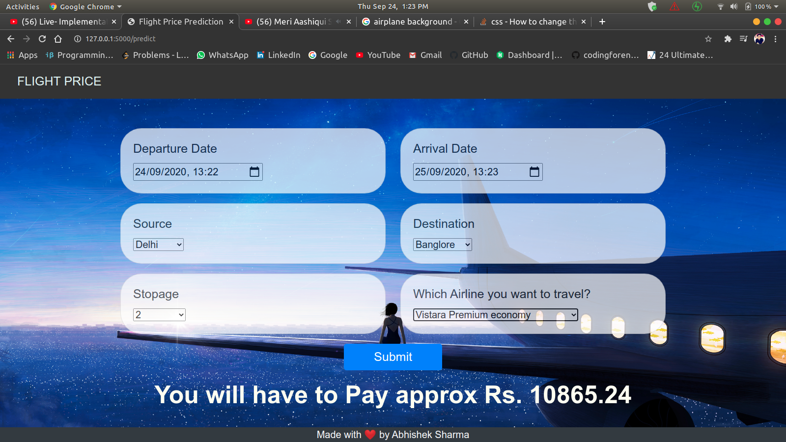

# Flight-Price-Prediction

- I did this project just to perform some next level feature engineerings to elevate the performane of this model.  
- I have also created a gui using HTML,Bootstrap,CSS and implemnted the backend in Flask for this project and will be uploading that on Heroku soon.  
- Actually this was a Kaggle problem.  
- Initially I used RandomForestRegressor but that was not giving very satisfying results so I used RandomSearchCV to find best hyerparameters and came up witha a  good model with r2 score of around 0.82.  
- Also used ExtraTreeRegressor to visualize the importances of all the features.  
- Just run app.py to see the gui on local host.  
  
Do visit my blog for better explanations: https://machinelearningprojects.net/flight-price-prediction/
  

